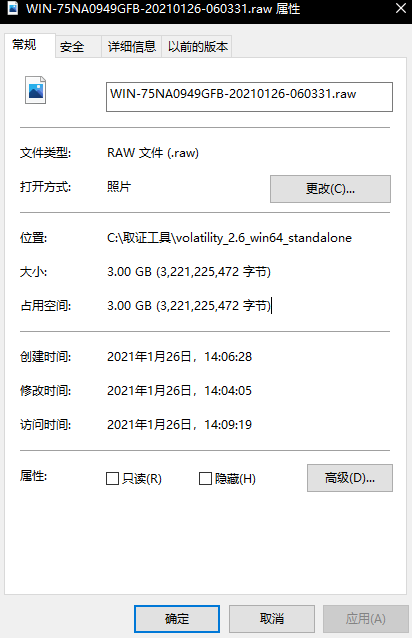
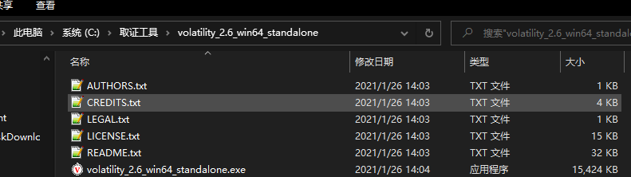

# 内存取证
在一些实际情况下，我们获得一台开着机的计算机，为了尽可能的不破坏其的内容，保存内存中运行着的程序，我们通常会使用`DumpIt.exe`来将整个内存完整的dump下来，然后对dump下来的文件进行取证。

DumpIt工具使用非常简单。


直接按Y键

会生成一个和运行内存大小一样的raw文件。



# Volatility

> Volatility是一款开源的，基于Python开发的内存取证工具集，可以分析内存中的各种数据。Volatility支持对32位或64位Wnidows、Linux、Mac、Android操作系统的RAM数据进行提取与分析。

## 安装

- kali自带

- [Windows下载地址](https://www.volatilityfoundation.org/releases)

Windows中下载完是这样的：



```bash
volatility_2.6_win64_standalone.exe -h
```

## 使用

```bash
volatility -f xxx imageinfo
#使用imageinfo插件来猜测dump文件的profile值
volatility -f xxx --profile=xxx pslist
#指定profile值,使用pslist去列举系统进程
volatility cmdscan -f xxx --profile=xxx
#查看历史命令
volatility iehistory -f xxx --profile=xxx
#查看IE历史信息
volatility -f mem.raw --profile=Win7SP0x86 screenshot --dump-dir=./
#查看截图


**补充**
#内存中注册表以及位置
volatility -f ROOT-6B78B0CA4D-20190202-044824.raw --profile=Win2003SP2x86 hivelist  

#得到用户密码的哈希值
volatility -f ROOT-6B78B0CA4D-20190202-044824.raw --profile=Win2003SP2x86 -y （system的virtual地址） -s （sam的virtual地址）  

#cmd执行的命令
volatility -f ROOT-6B78B0CA4D-20190202-044824.raw --profile=Win2003SP2x86 cmdscan 

#网络连接情况
volatility -f ROOT-6B78B0CA4D-20190202-044824.raw --profile=Win2003SP2x86 netscan  

#IE使用情况
volatility -f ROOT-6B78B0CA4D-20190202-044824.raw --profile=Win2003SP2x86 iehistory

#filescan查看文件
volatility -f ROOT-6B78B0CA4D-20190202-044824.raw --profile=Win2003SP2x86 filescan

#提取filescan的文件,利用dumpfiles
volatility -f memory  --profile=WinXPSP2x86 dumpfiles -Q 0x00000000053e9658 --dump-dir=./  

-Q制定了文件物理位置的开始，另一个参数制定了保存的位置。
```

|命令|	功能|
|-|-|
|cmdline/cmdscan|	列出历史cmd命令|
|filescan|	扫描文件，可配合grep使用|
|pslist/psscan|	列出进程列表|
|svcscan|	扫描windows服务列表|
|memdump|	从内存dump进程的内存|
|dumpfiles|	从内存dump文件|

[官方命令](https://github.com/volatilityfoundation/volatility/wiki/Command-Reference)

了解几个文件后缀

```bash
vmem文件
#表示虚拟内存文件，与pagefile.sys相同
raw文件
#raw文件是内存取证工具Dumpit提取内存生成的内存转储文件
```

除此之外，还需要了解一下profile（配置文件）

> profile是特定操作系统版本以及硬件体系结构(x86,x64,ARM)中VTypes,共用体,对象类型的集合.除了这些组件以外,profile还包括:元数据:操作系统的名称,内核版本,以及编译号. 系统调用信息:索引以及系统调用的名称 常量值:全局变量-在某些操作系统中能够在硬编码的地址处找到的全局变量 系统映射:关键全局变量和函数的地址(仅限Linux和Mac)

每个profile都有个一个唯一的名称,通常是由操作系统的名称,版本,服务包,系统结构等信息组成.

如:Win7SP1x64是64位的Windows 7 SP1系统配置文件的名称